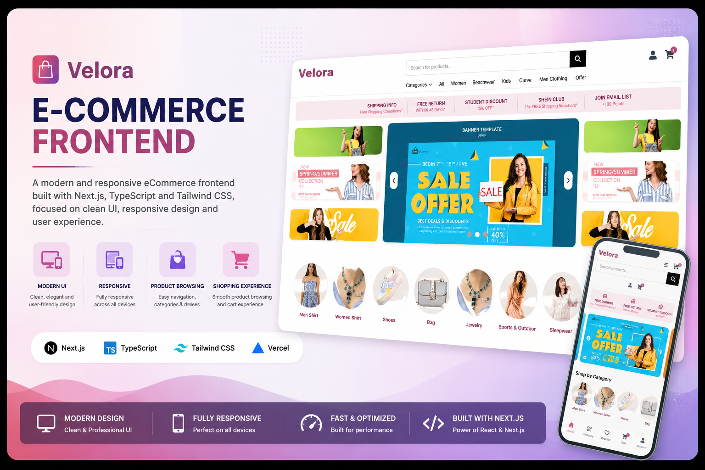
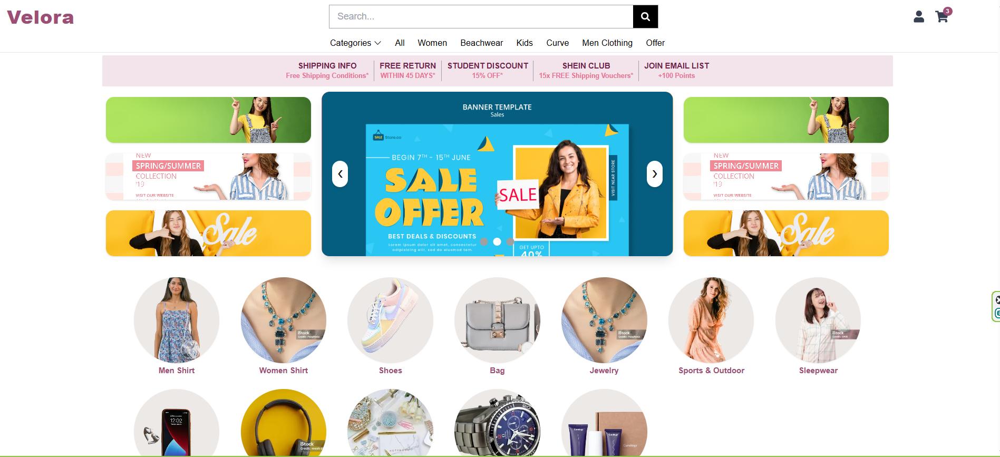
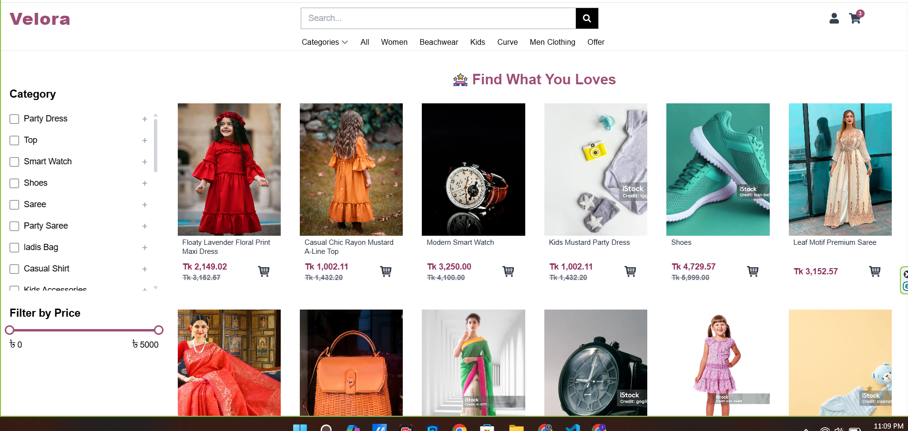
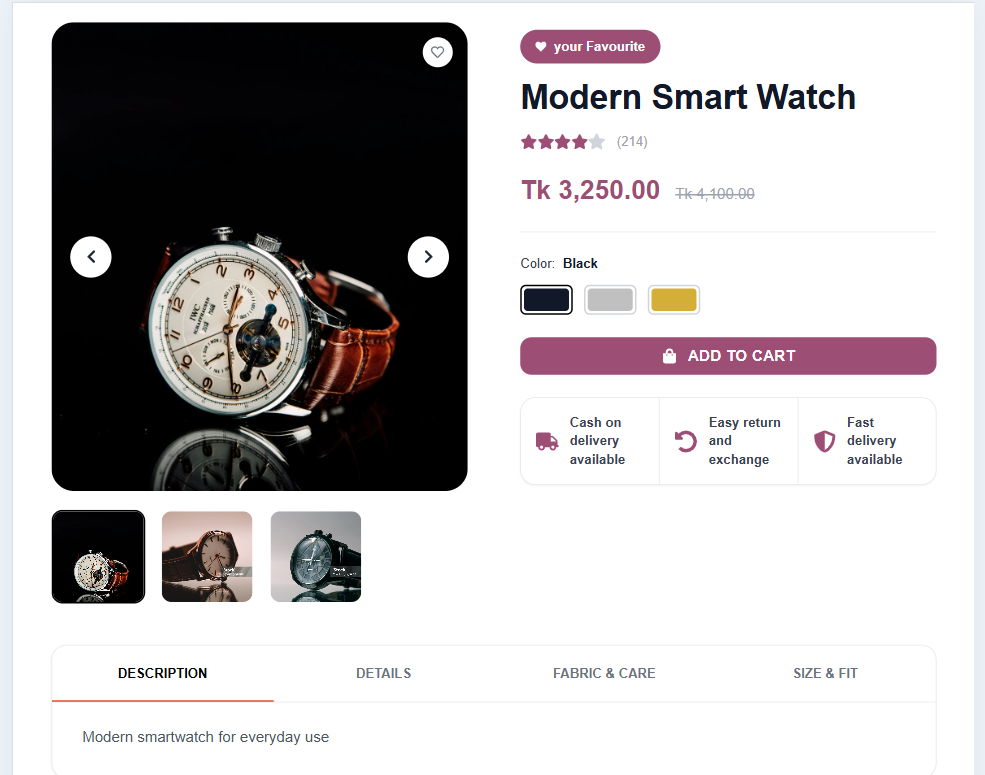
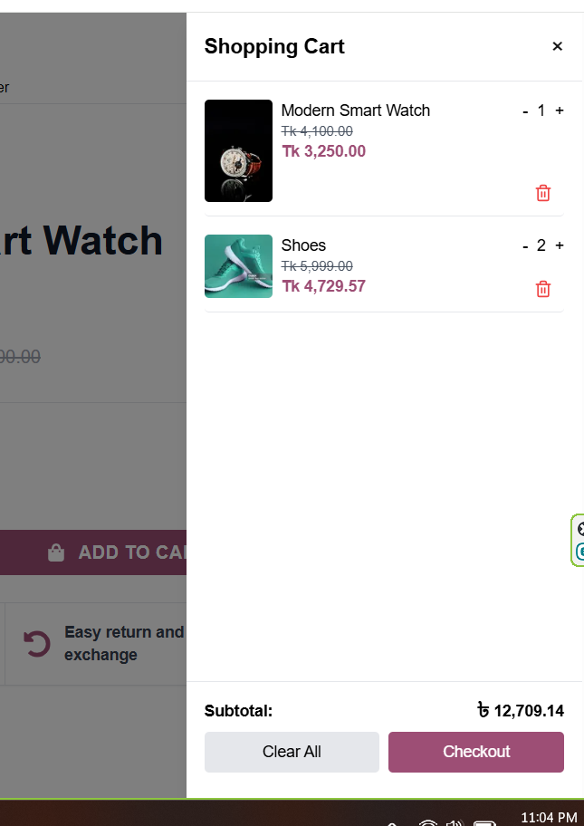
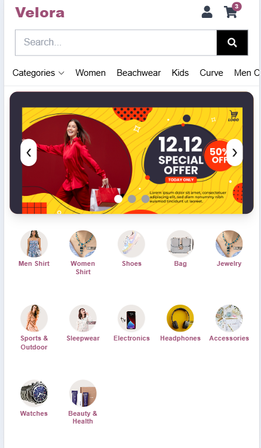

<p align="center">
  
</p>

# Velora — E-Commerce Frontend

A modern and responsive eCommerce frontend built with Next.js, TypeScript, and Tailwind CSS, focused on clean UI, responsive design, and a smooth shopping experience.

---

## Project Overview

Velora is a frontend-focused eCommerce website built with Next.js, TypeScript, and Tailwind CSS.

The project focuses on creating a modern, responsive, and user-friendly shopping experience using static/demo product data.

The main goal of this project is to showcase frontend development skills, UI design, responsive layouts, product browsing, and shopping interactions.

**No custom backend or production database is included in this project.**

---

## Live Demo

🌐 **Live Website:**  
https://e-commerce-frontend-project-2.vercel.app

---

## Features

- Responsive eCommerce UI
- Modern and clean user interface
- Product listing
- Product details
- Product categories
- Product search and filtering
- Shopping cart UI
- Responsive navigation
- Modern product cards
- Promotional banners
- Category browsing
- Mobile-friendly design
- Smooth shopping experience

> Features listed above reflect the current frontend implementation.

---

## Tech Stack

- **Next.js**
- **React**
- **TypeScript**
- **Tailwind CSS**
- **React Icons**
- **rc-slider**
- **Sonner**

---

## Screenshots

### Homepage



### Product Listing



### Product Details



### Shopping Cart



### Responsive Design

The interface is designed to provide a responsive shopping experience across desktop, tablet, and mobile devices.



---

## Project Structure

```text
src
│
└── app
    ├── components
    ├── data
    ├── utils
    ├── all-products
    ├── category
    ├── group
    ├── product
    ├── search
    ├── checkout
    ├── Offer
    └── thankyou
```

---

## Getting Started

### Prerequisites

Make sure you have the following installed:

- Node.js
- npm

### Installation

Clone the repository:

```bash
git clone https://github.com/Fatema-Akther/velora-ecommerce-frontend.git
```

Navigate to the project directory:

```bash
cd velora-ecommerce-frontend
```

Install the dependencies:

```bash
npm install
```

### Run the Development Server

Start the development server:

```bash
npm run dev
```

Then open your browser and visit:

```text
http://localhost:3000
```

---

## Data & Disclaimer

This project uses static/demo product data for showcasing the frontend experience.

**No custom backend or production database is included in this project.**

The product information, promotional content, images, and other data are used for demonstration and frontend development purposes only.

---

## Purpose

This project was created to demonstrate:

- Frontend development with Next.js
- Responsive UI implementation
- Modern eCommerce interface design
- Component-based development
- TypeScript usage
- Tailwind CSS styling
- Product browsing experience
- Responsive and user-friendly layouts

---

## License

This project is created for portfolio and educational purposes.
